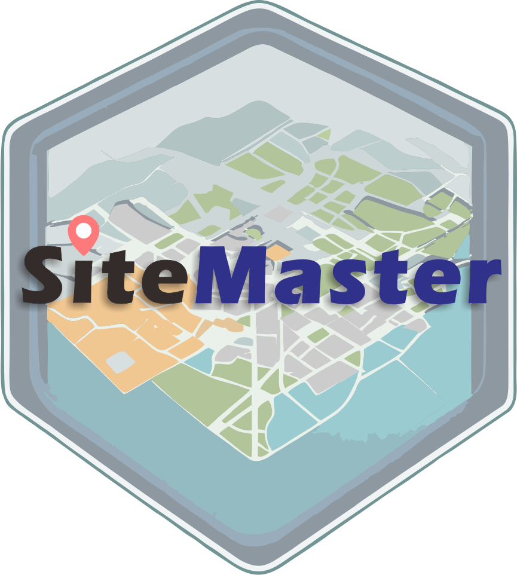

<div align="center">
  




⭐ 我们的模型：[模型地址](https://www.modelscope.cn/models/ECNUBigDataLab/SiteMaster)

</div>

# 智能选址大师SiteMaster
本项目用于参加书生·浦源大模型挑战赛（春季赛）。**智能选址大师SiteMaster**是利用城市范围内的**POI数据**和**地铁站点数据**，基于[**InternLM2-Chat-7b模型**](https://github.com/InternLM/InternLM)和[**Lagent框架**](https://github.com/InternLM/lagent)搭建的，针对于空间中某类设施进行智能选址的大模型。模型存放于ModelScope，应用部署于OpenXLab。  

🤝 项目贡献者：
[@hmengECNU](https://github.com/hmengECNU)、[@LingmiaoXD](https://github.com/LingmiaoXD) 、[@South133](https://github.com/South133)、[@Jacexm](https://github.com/Jacexm)

## 📚 项目介绍
**智能选址大师SiteMaster**是一款智能选址对话模型，旨在协助用户精准而深入地确定最佳选址。利用广泛的背景知识，它能够评估用户输入，推荐合适的地址，并充分考虑每个位置周围复杂的实际情况。具备先进的文本处理、推理和检索能力，智能选址大师能够提供针对特定需求的细致建议，并将选址地点在地图上可视化。

项目的简单介绍见Bilibili:[]()

项目的应用Demo见OpenXLab平台[]() 

**智能选址大师SiteMaster**目前处于初期阶段，虽然尚未完全成熟，但具备极高的探索潜力。我们诚邀您体验并提出宝贵建议，以帮助我们不断改进。期待您的参与🎉！

## 📋 数据集构建
### 1. 基础数据获取与清洗
基于**高德地图**和**大众点评**获取上海市范围内的**POI数据**及**地铁站点数据**。高德地图**POI数据**包含设施名称、设施类型、设施地址等信息，将信息与大众点评餐饮数据连接，获取每家店的点评活跃度、人均消费等信息；**地铁站点数据**包含地铁站名称、地铁站经纬度等信息，能够指示上海市范围内交通便利、适合商业选址的区域。根据这两组数据，使用**ArcGIS**的空间分析工具，统计每个交通点周围一定服务范围内各POI数量，作为上海市范围内选址合理性评估的基础数据。

我们将上海市范围内的POI数据划分为14个大类：餐饮美食、公司企业、购物消费、交通设施、金融机构、酒店住宿、科教文化、旅游景点、汽车相关、商务住宅、生活服务、休闲娱乐、医疗保健、运动健身。每一个大类中可细分为数个小类。例如：餐饮美食包括家常菜馆、火锅和川菜、海鲜店、奶茶店、小吃店（烧烤店）、湘菜馆、素菜馆、家常菜馆等。每一个大类中可以细分为数个小类：

- 餐饮美食包括：家常菜馆、火锅和川菜、海鲜店、奶茶店、小吃店（烧烤店）、湘菜馆、素菜馆、家常菜馆等  
- 公司企业包括：公司、工厂等
- 购物消费包括：百货、超市、首饰店等
- 休闲娱乐包括：酒吧、棋牌室、KTV、网吧、度假区和游乐场、影院和剧场等
- ......

基于上述POI类别，设置不同商业对象选址的要求，构建选址评价体系。

### 2. 对话语料构建
- 📌选址推荐  
   a. 闵行区哪个地方开川菜馆比较好？（限定商业类型和区域范围）  
   b. 哪里可以开百货商场？（限定商业类型）  

- 📌类型推荐   
   a. 剑川路适合开什么类型的饭馆呢？（限定地点）  
   b. 我想在静安寺开店，开什么比较合适？

- 📌选址分析  
   a. 我想在南京西路开小吃店，可以吗？（限定商业类型和地点）  
   b. 周边已经有十几家火锅店了，我还能再开吗？（设定情境）

- 📌选址对比  
   a. 静安寺和后滩，哪里更合适开素菜馆？（限定对比选址和商业类型）

针对每一种设施类型（小类），我们基于选址评价体系建立多个判断层，编写代码构建了多种可能产生的对话语料。例如：
```json
{
    "conversation": [
        {
            "system": "请你耐心地为我提供选址指导。",
            "input": "我想在上海开一家美容美发店，开在哪里比较合适？",
            "output": "上海是中国最大的城市之一，选择在上海开设美容美发店是一个非常不错的选择。以下是几个可能合适的选址建议：1. 江川东路：选择这个位置是一个不错的选择，这里交通便利，人流量大，具有较大的开设美容美发店的需求，便于为市民们提供服务。2. 嘉松中路：这里的美容美发店目前较少，具有较大的开设需求，如果可以在这里开设美容美发店将会弥补这里的一大缺失，方便了人们的生活。3. 浦东机场：将美容美发店开设在这里也非常好，可以配合周围的其他服务，帮助该地区提高自己的居民活跃度，为人们的繁忙生活带来便利。不过，在上海市开设美容美发店需要考虑的因素非常多，例如周边是否存在竞争，附近市场需求量是否足够大，租金是否昂贵等等，建议您对感兴趣的地区开展市场调研和分析，相信您一定可以开一家非常不错的美容美发店，提前祝您生意兴隆！"
        }
    ]
}
{
    "conversation": [
        {
            "system": "请你耐心地为我提供选址指导。",
            "input": "我想在浦东新区开个奶茶店，哪里比较好？",
            "output": "根据您的浦东新区范围要求，为您推荐：世纪大道：附近餐厅众多，其中有7家火锅店、5家烧烤摊。这些都是开饮品店的有利条件，您可以与其他餐饮店搭配合作，相互促进业务，增加客流量和销售额。世纪大道的消费水平位于上海市前列，有密集的产业园区和写字楼，适合提供面向白领的咖啡类饮品。附近有多个旅游景点，顾客以游客居多，适合开甜品类餐饮店，提供奶茶、糕点和小吃，并为游客提供休憩、聊天的场所。世纪大道属于人口居住密集区，且有较多休闲娱乐场所，推荐您选择在这些区域附近经营。而且，世纪大道仅有10家奶茶店，市场仍存在缺口，适合您在此处选址开店。潍坊路：附近餐厅众多，其中有9家火锅店、11家烧烤摊。这些都是开饮品店的有利条件，您可以与其他餐饮店搭配合作，相互促进业务，增加客流量和销售额。潍坊路属于人口居住密集区，顾客群体稳定，且有密集的产业园区和写字楼，适合提供面向白领的咖啡类饮品。潍坊路也有较多休闲娱乐场所，推荐您选择在这些场所附近经营，吸纳广大客源。而且，潍坊路仅有8家奶茶店，市场仍存在缺口，适合您在此处选址开店。杨思：附近餐饮店极其兴盛，其中有28家火锅店、11家烧烤摊。这些都是开饮品店的有利条件，您可以与其他餐饮店搭配合作，相互促进业务，增加客流量和销售额。此外，附近有多个旅游景点，顾客以游客居多，适合奶茶店的开设。杨思属于人口居住密集区，顾客群体稳定，且有密集的产业园区和写字楼，适合提供面向白领的咖啡类饮品。杨思也有较多休闲娱乐场所，推荐您选择在这些场所附近经营，提供解渴、功能性饮品。\n而且，杨思仅有7家奶茶店，市场仍存在缺口，适合您在此处选址开店。"
        }
    ]
}
{
    "conversation": [
        {
            "system": "请你耐心地为我提供选址指导。",
            "input": "我想在大康路开一家店铺，开什么比较合适？",
            "output": "大康路是上海人流量较多，交通较为便利的一个地区，在大康路开设任何一家店铺都非常具有潜力。从已有店铺竞争的角度来看，开设摄影文印店、酒吧、棋牌室都是非常合适的，因为目前大康路附近的摄影文印店、酒吧、棋牌室都比较少，可能有潜在需求。但需要注意的是，目前大康路附近并未开设这些店铺，可能是存在其他原因，例如租金成本太高，或者周围居民消费水平不高等问题。建议您对大康路附近地区开展市场调研和分析再做决定，提前祝您生意兴隆！"
        }
    ]
}
```
将语料整理到.jsonl格式文件中，形成数据集。

## 🔧 模型微调
### 1. 环境配置
创建虚拟环境，安装XTuner，下载InternLM2-Chat-7b模型文件。

### 2. XTuner微调
拷贝配置文件：
```shell
xtuner list-cfg
xtuner copy-cfg internlm_7b_qlora_json_e3 ${SAVE_PATH}
```

根据本地情况修改配置文件，包括预训练模型存放的位置、微调数据的存放位置等。使用命令行将选址数据集放入InternLM2-Chat-7b训练：
```shell
xtuner train /root/internlm_7b_qlora_json_e3_copy.py --deepspeed deepspeed_zero2
```

### 3. 参数转换与合并
使用XTuner将训练后的.pth格式参数转Hugging Face格式：
```shell
xtuner convert pth_to_hf $CONFIG_NAME_OR_PATH $PTH $SAVE_PATH
```

将参数与原始模型合并，保存得到完整模型：
```shell
xtuner convert merge $NAME_OR_PATH_TO_LLM $NAME_OR_PATH_TO_ADAPTER $SAVE_PATH --max-shard-size 2GB
```
完整模型开源在ModelScope平台：[模型地址](https://www.modelscope.cn/models/ECNUBigDataLab/SiteMaster)

## 🔎 快速使用


## ✏️ 未来规划
尽管智能选址大师SiteMaster目前已经投入使用，但我们意识到仍有一些问题需要解决，输出结果与预期可能不尽相符。例如，可能会出现回答不准确的情况，这显然不符合我们对于精准度的追求。为了提供更为精确的选址信息，我们打算在未来研究中引入更为丰富的语料库和多轮对话语料。此外，尽管我们已经整合了高德API，但其稳定性仍然有待提升。因此，我们致力于不断改进该模型，以确保其能够稳定输出选址位置及其地图，并增添更为丰富的细节信息，以满足用户的需求。

## 📑 开源许可证
该项目采用[Apache License 2.0 开源许可证](LICENSE.txt)
